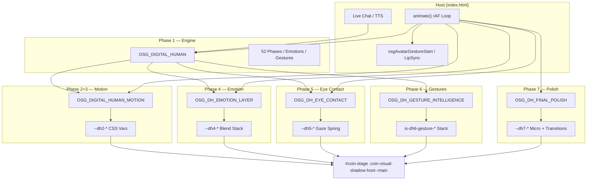

# OSG Digital Human — Vollständiger Abschlussreport

**Projekt:** Pauli Best Price — Digital Human Engine  
**Generated:** 2026-06-26  
**Status:** Phase 1–7 abgeschlossen  
**Prinzip:** Additive Erweiterung, keine API-Breaks, keine Regressionen in TTS/LipSync/Empathy

---

## Executive Summary

In sieben aufeinander aufbauenden Phasen wurde aus dem bestehenden Pauli-Münz-Avatar eine **mehrschichtige Digital-Human-Engine** entwickelt. Jede Phase fügt eine isolierte Schicht hinzu; frühere Phasen bleiben funktionsfähig und unverändert in ihren öffentlichen APIs.

| Phase | Fokus | Kern-Dateien |
|-------|-------|--------------|
| **1** | Asset & State Engine | `osg_digital_human_engine.js`, `osg_digital_human.css` |
| **2** | Production Motion | `osg_digital_human_motion.js`, `osg_digital_human_motion.css` |
| **3** | Micro Motion | Erweiterung Motion (Noise, Shoulder, Weight, Perf) |
| **4** | Emotion Layer | `osg_dh_emotion_layer.js`, `osg_dh_emotion_layer.css` |
| **5** | Eye Contact | `osg_dh_eye_contact.js`, `osg_dh_eye_contact.css` |
| **6** | Gesture Intelligence | `osg_dh_gesture_intelligence.js`, `osg_dh_gesture_intelligence.css` |
| **7** | Final Polish | `osg_dh_final_polish.js`, `osg_dh_final_polish.css` |

---

## Architektur-Übersicht



---

## Layer-Stack auf der Münze

```
┌─────────────────────────────────────────────────────────────┐
│  #coin-stage (State-Klassen: is-dh-*, is-dh2-*, is-dh4-*…)  │
├─────────────────────────────────────────────────────────────┤
│  Phase 7  --dh7-micro-*     Idle-Floor, Atempausen, Impuls  │
│  Phase 4  --dh4-face/head   Emotion Filter + Head Offset    │
│  Phase 2  --dh2-breath/sway/head/eye/blink                  │
│  Phase 5  --dh5-eye-x/y     Gaze (calc mit dh2 + dh4)       │
│  Phase 6  is-dh6-gesture-*  Kombinierbare Gesten-Overlays   │
│  Legacy   osgApplyAvatarTransform / LipSync inline style    │
└─────────────────────────────────────────────────────────────┘
```

**Transform-Ziel:** `.coin-visual-shadow-host--main` (nicht `#coin-stage` direkt), damit `style.css`-Resets auf `is-speaking`, `is-wai`, `is-busy` wirksam bleiben.

---

## Phase 1 — Asset & Animation Completion

### Geliefert
- `OSG_DIGITAL_HUMAN` State Engine mit 52 Phasen
- Hooks: thinking, listening, speaking, emotion, gesture
- CSS-Fallbacks für alle `is-dh-*` States
- Audio-Audit: `scripts/osg-phase1-audio-audit.mjs`
- Integration in `animate()`-Loop

### API (unverändert)
```js
OSG_DIGITAL_HUMAN.setPhase(phase, opts)
OSG_DIGITAL_HUMAN.setEmotion(emotion, opts)
OSG_DIGITAL_HUMAN.setGesture(gesture, opts)
OSG_DIGITAL_HUMAN.chooseGesture(reply)  // Phase 6 wrappt diese Funktion
OSG_DIGITAL_HUMAN.detectEmotion(text)
OSG_DIGITAL_HUMAN.enterThinking / leaveThinking
OSG_DIGITAL_HUMAN.enterListening / leaveListening
OSG_DIGITAL_HUMAN.enterSpeaking / leaveSpeaking
OSG_DIGITAL_HUMAN.tick(now, delta)
```

### Report
`docs/OSG-DIGITAL-HUMAN-PHASE1-REPORT.md`

---

## Phase 2 — Production Motion

### Geliefert
- Atmung, Sway, Kopf, Augen, Blinzeln
- Phasen- und emotionsgesteuerte Targets
- CSS Custom Properties `--dh2-*`
- Ein Tick-Slot via `OSG_DIGITAL_HUMAN_MOTION.update()`

### Report
`docs/OSG-DIGITAL-HUMAN-PHASE2-REPORT.md`

---

## Phase 3 — Micro Motion

### Geliefert
- Multi-Frequenz-Noise (3 Bänder/Achse)
- Shoulder-Layer (`--dh2-shoulder-rz`)
- Weight-Shift (`--dh2-weight-x`)
- Frame-Skip auf Low-End / Mobile (≤480px → skip 2)
- Page-Visibility-Pause
- `prefers-reduced-motion` Runtime-Guard

### Report
`docs/OSG-DIGITAL-HUMAN-PHASE3-REPORT.md`

---

## Phase 4 — Emotion Layer

### Geliefert
- Blend-Stack (max. 4 Emotionen, Crossfade 0.6 s)
- Kanäle: face (Filter), eye (Gaze-Offset), head (Pitch/Roll)
- `--dh4-*` CSS Vars, Klasse `is-dh4-active`
- Event-Hook auf `osg:digital-human:emotion`

### API
```js
OSG_DH_EMOTION_LAYER.setEmotion(name, intensity)
OSG_DH_EMOTION_LAYER.addEmotion(name, weight, opts)
OSG_DH_EMOTION_LAYER.blendTwo(a, b, ratio)
OSG_DH_EMOTION_LAYER.getStack()
OSG_DH_EMOTION_LAYER.tick(dt)
```

### Report
`docs/OSG-DIGITAL-HUMAN-PHASE4-REPORT.md`

---

## Phase 5 — Eye Contact

### Geliefert
- Gaze-State-Machine: camera, user, away_think, away_recall, scan_left/right, return
- Spring-Interpolation (k=28, d=8.2)
- `--dh5-eye-x/y` kombiniert mit dh2 + dh4 via CSS calc()
- Phasengetriebene Übergänge

### API
```js
OSG_DH_EYE_CONTACT.tick(dt)
OSG_DH_EYE_CONTACT.setState(state)
OSG_DH_EYE_CONTACT.getState()
```

### Report
`docs/OSG-DIGITAL-HUMAN-PHASE5-REPORT.md`

---

## Phase 6 — Gesture Intelligence

### Geliefert
- Deterministische Intent-Klassifikation (kein Random)
- Abhängig von: Emotion + Antworttyp (sales, explanation, greeting, farewell, apology, humor, …)
- Kombinierbarer Gesten-Stack (max. 3)
- Wrap von `chooseGesture` ohne API-Break
- Bridge-Hooks: Laugh, Applause, Lean Forward

### API
```js
OSG_DH_GESTURE_INTELLIGENCE.applyFromReply(reply, opts)
OSG_DH_GESTURE_INTELLIGENCE.classifyIntent(text)
OSG_DH_GESTURE_INTELLIGENCE.getStack()
```

### Report
`docs/OSG-DIGITAL-HUMAN-PHASE6-REPORT.md`

---

## Phase 7 — Final Polish

### Geliefert
- Weiche Übergänge (Spring + Phase-Blend + Filter-Transition 0.42 s)
- Idle-Floor: Münze nie vollständig still
- Natürliche Atempausen (`--dh7-breath-hold`)
- Mikroreaktionen auf Phase/Emotion/Speech/Gesture-Events
- Performance: Frame-Skip-Sync, CSS-Write-Cache, Visibility-Pause

### API
```js
OSG_DH_FINAL_POLISH.tick(dt)
OSG_DH_FINAL_POLISH.addImpulse(type, strength)
OSG_DH_FINAL_POLISH.getState()
```

### Report
`docs/OSG-DIGITAL-HUMAN-PHASE7-REPORT.md`

---

## Datei-Inventar (Digital Human)

### Scripts
| Datei | Phase |
|-------|-------|
| `assets/scripts/osg_digital_human_engine.js` | 1 |
| `assets/scripts/osg_digital_human_motion.js` | 2+3 |
| `assets/scripts/osg_dh_emotion_layer.js` | 4 |
| `assets/scripts/osg_dh_eye_contact.js` | 5 |
| `assets/scripts/osg_dh_gesture_intelligence.js` | 6 |
| `assets/scripts/osg_dh_final_polish.js` | 7 |

### Styles
| Datei | Phase |
|-------|-------|
| `assets/styles/osg_digital_human.css` | 1 |
| `assets/styles/osg_digital_human_motion.css` | 2+3 |
| `assets/styles/osg_dh_emotion_layer.css` | 4 |
| `assets/styles/osg_dh_eye_contact.css` | 5 |
| `assets/styles/osg_dh_gesture_intelligence.css` | 6 |
| `assets/styles/osg_dh_final_polish.css` | 7 |

### Reports
| Datei |
|-------|
| `docs/OSG-DIGITAL-HUMAN-PHASE1-REPORT.md` |
| `docs/OSG-DIGITAL-HUMAN-PHASE2-REPORT.md` |
| `docs/OSG-DIGITAL-HUMAN-PHASE3-REPORT.md` |
| `docs/OSG-DIGITAL-HUMAN-PHASE4-REPORT.md` |
| `docs/OSG-DIGITAL-HUMAN-PHASE5-REPORT.md` |
| `docs/OSG-DIGITAL-HUMAN-PHASE6-REPORT.md` |
| `docs/OSG-DIGITAL-HUMAN-PHASE7-REPORT.md` |
| `docs/OSG-DIGITAL-HUMAN-PHASE1-AUDIO-AUDIT.json` |
| `docs/OSG-DIGITAL-HUMAN-COMPLETION-REPORT.md` (dieses Dokument) |

---

## Integration in index.html

### CSS-Reihenfolge (Head)
```
osg_digital_human.css
osg_digital_human_motion.css
osg_dh_emotion_layer.css
osg_dh_eye_contact.css
osg_dh_gesture_intelligence.css
osg_dh_final_polish.css          ← zuletzt (höchste Cascade-Priorität)
```

### Script-Reihenfolge (Body)
```
pauli_avatar_animations.js
osg_digital_human_engine.js
osg_digital_human_motion.js
osg_dh_emotion_layer.js
osg_dh_eye_contact.js
osg_dh_gesture_intelligence.js
osg_dh_final_polish.js
avatar-3d-bridge.js
tts-lipsync-bridge.js
```

### animate()-Loop (Digital Human Block)
```js
osgLipSyncTick(now);
OSG_DIGITAL_HUMAN.tick(now, delta);
OSG_DIGITAL_HUMAN_MOTION.update(now, delta);
OSG_DH_EMOTION_LAYER.tick(delta);
OSG_DH_EYE_CONTACT.tick(delta);
OSG_DH_FINAL_POLISH.tick(delta);
osgAvatarGestureTick(now, delta);
```

---

## Performance-Richtlinien (eingehalten)

| Regel | Umsetzung |
|-------|-----------|
| Ein rAF-Slot | Alle DH-Ticks im Host-Loop |
| Kein setInterval | Keine DH-Phase nutzt Interval |
| Mobile Thailand-Ziel | Frame-Skip=2 bei ≤480px / ≤2 Cores |
| Kein schwerer First Paint | DH-Scripts deferred, CSS modular |
| Page Visibility | Motion + Polish pausieren bei hidden Tab |
| Reduced Motion | Runtime + CSS Guards in P3, P5, P6, P7 |
| CSS Write Budget | Phase 7 cached unchanged vars |

---

## Unveränderte Systeme (Constraint-konform)

- `playPauliVoice()` / Cloud TTS Guard
- `OSGLipSync` / `tts-lipsync-bridge.js` (Amplitude-LipSync)
- `OSG_AUDIO_REGISTRY` / Segment Service
- `OSG_EMPATHY_LOGIC` (nur gelesen via Events)
- `OSG_PauliAvatarAnimations` Manifest
- Legacy `osgAvatarGestureStart` / Tour / Empathy CSS

---

## Bekannte Grenzen

| Bereich | Limit |
|---------|-------|
| Lip-Sync | Amplitude-basiert, keine Viseme/Blendshapes |
| Speak-Video | OpenAI-Loop in `pauli_avatar_animations.js` deaktiviert |
| Augen | CSS Radialgradient-Overlay, kein SVG-Rig |
| Gesicht | CSS Filter, kein Facial Rig |
| Gesten-Klassifikation | Regex/heuristisch, kein LLM-Intent |
| CSS Keyframes | Nur eine Transform-Animation pro Element gleichzeitig |
| Audio-Audit | 86 doppelte MP3-Template-Segmente (Phase 1 dokumentiert) |

---

## Event-Bus (Custom Events)

| Event | Quelle | Konsumenten |
|-------|--------|-------------|
| `osg:digital-human:phase` | Phase 1 | Motion, Eye, Polish |
| `osg:digital-human:emotion` | Phase 1 | Emotion Layer, Gesture, Polish |
| `osg:digital-human:gesture` | Phase 1 | Motion, Gesture, Polish |
| `osg:digital-human:speaking-start/stop` | Phase 1 | Polish |
| `osg:digital-human:thinking-start/stop` | Phase 1 | Polish |
| `osg:digital-human:gesture-intelligence` | Phase 6 | Polish |

---

## Abnahme-Checkliste (Gesamt)

- [ ] Idle: subtile Bewegung dauerhaft sichtbar
- [ ] Live-Chat: thinking → speaking → listening Zyklen ohne Ruckler
- [ ] Emotion: weiche Filter-Übergänge bei Empathy-Triggers
- [ ] Blick: Kamera-Kontakt beim Sprechen, Cursor-Tracking beim Zuhören
- [ ] Gesten: Verkauf/Erklärung/Begrüßung/Verabschiedung korrekt klassifiziert
- [ ] Mobile ≤480px: Münze nicht über Content, Performance akzeptabel
- [ ] Reduced Motion: System respektiert OS-Einstellung
- [ ] TTS/LipSync: keine Regression nach DH-Integration
- [ ] Flutter Bridge: `trigger3DAvatar` weiterhin funktional

---

## Nächste optionale Erweiterungen (nicht im Scope)

1. Intent aus `speechKey`/`segmentKey` statt nur Reply-Text (Gesture Phase 6+)
2. Echte Viseme-LipSync wenn Blendshape-Rig verfügbar
3. Shared `osg_dh_utils.js` für lerp/clamp/setCssVar (Refactor)
4. Deduplizierung mousemove-Listener (Motion P2 vs Eye P5)

---

## Abschluss

**Das Digital-Human-Programm Phase 1–7 ist vollständig implementiert.**

Alle Ziele der sieben Phasen wurden additiv umgesetzt:
- Vollständige State-Engine und Motion-Pipeline
- Emotion-Blend, Eye-Contact, intelligente Gesten
- Final Polish mit biologischer Idle-Bewegung, weichen Übergängen und Performance-Optimierung

Einzelreports pro Phase liegen unter `docs/OSG-DIGITAL-HUMAN-PHASE*-REPORT.md`.
